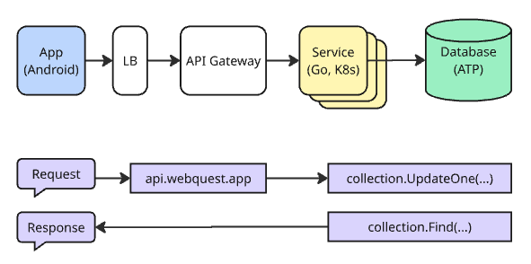
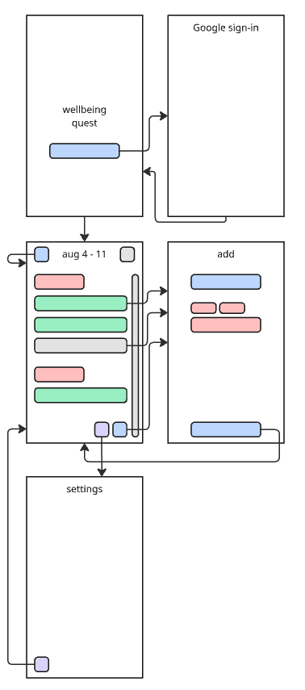

# Design for Wellbeing Quest's Activities

## Motivation

An **activity** is a physical or mental
task that a person has spent time on.
A **feeling** is an emotion that the
person associates with that activity.
A **weekly update** gives a progress
report of how many activities per
feeling were completed. Then the
person can understand if they'd like
to spend more time on certain activities
or not.

An example is if I organize the following
as `activity (feeling)`:

- Spend time at a coffee shop (Relaxed)
- Watch YouTube (Relaxed)
- Hike at the park (Accomplished)
- Meet up with friends (Accomplished)
- Played a video game (Accomplished)

Then at the end of the week, I can review:

- Relaxed (2)
- Accomplished (3)

Furthermore, past activities are a signal
of how to relive those feelings:

- Meditate (Relaxed)
- Water my plants (Relaxed)
- Take a bath (Relaxed)
- Exercise (Accomplished)
- Chores (Accomplished)
- Play with my cat (Accomplished)

I personally have used this approach to
keep a pulse on my mental health and make
sure I'm not forgetting the activities
that make me feel relaxed and accomplished.

### Goals

My goals for this project are personal:

- Spend time designing and building a personal project
- Explore new technologies and learn to develop systems
- Motivate myself by solving problems that I'm interested in

### User stories

- A user adds an activity and tags it with their feelings
- A user views the activities they've accomplished this week and can look back at previous weeks
- A user sees previous activities for the current week and can click to auto-fill
- A user can add multiple of the same activities for the same week if they'd like
- A user can see previous activities suggested when they type
- A user can change an activity's feelings when adding a new activity
- A user can have multiple feelings per activity
- A user can sign-in with an existing account like their Google account

### Features

- Activities
- Feelings
- Suggestions
- Group Activities
- Notifications

### Requirements

Functional:

- Add activities with tagged feelings
- Suggestions for activity and feeling names
- View by week
- Weekly notification

Non-functional:

- Available and reliable
- Durable and flexible data stored
- Scalable for future

### Estimates

The app is very small scale, but I can
estimate anyways for myself and scale
it by user.

1k users, avg 20 activities per week,
avg 100 week reviews per week.
1KB per activity given users might add
descriptions.

Traffic:

- reads per second
  - `1k users * 100 week reviews = 100k per week`
  - `100k per week / 7 days = 14.3k per day`
  - `14.3k per day / 86400 seconds per day = 0.17 per second`
  - Result: `0.17 reads per second` on average
- writes per second
  - `read per second / 5 = 0.03 writes per second`
  - Result: `0.03 writes per second` on average

Storage:

- data per week
  - `1k users * 20 activites per week = 20k activities per week`
  - `20k activities per week * 1KB = 20MB per week`
  - Result: `20MB per week`
- data per year
  - `20MB per week * 52 weeks per year = 1GB per year`
  - Result: `1GB per year`
- data per 10 years
  - `1GB per year * 10 years = 10GB per 10 years`
  - Result: `10GB per 10 years`

## Deliverables

My key deliverables are:

- Design that includes requirements, user
  scenarios, and technology choices
- Prototype with single-user app to service
  running on localhost
- MVP with multi-user app to service running
  in cloud
- Polished with CI/CD
- Blog to share what I've learned

### Timeline

| Week    | Date   | Deliverables |
| ------- | ------ | ------------ |
| Week 1  | Aug 11 | Design       |
| Week 4  | Sep 1  | Prototype    |
| Week 9  | Oct 6  | MVP          |
| Week 11 | Oct 20 | Polished     |
| Week 12 | Oct 27 | Blog         |

### Success

I'll have more familiarity with the technologies
and the system I'm building.

### Risks

There could be unknowns with making a multi-user
app with Google sign-in or challenges setting
up in the cloud.

### Future

Activities are the stepping stone for wellbeing
quest, here are more feature ideas:

- Reflections for reading news, books, or games
  to encourage good activities or cope with
  challenging activities, this also can help
  with retention of the media
- Quests that allow people to earn badges and
  expand their activities
- Monthly and yearly updates that highlight
  interesting trends

## Design

How would I describe the design at a glance?

### Architecture

App sends requests to `api.wellbeingquest.app`
through Load Balancer (LB) and API Gateway to Service.
All of these components reside in a cloud provider.
Service is run within a Kubernetes (K8s) cluster
with Go app using Gin web framework. Database will
be relational and use ATP in the cloud, Postgresql
on localhost.

### Trade-offs

- Availability and scalability of Service by
  introducing LB and API Gateway while also
  hosting service in K8s.
- Not supporting incredible scale so the choice
  in simplifying to just multiple instances of
  Service seems reasonable. Alternative using
  message queues like RabbitMQ or Kafka felt
  like overkill based on the estimates that
  will likely have more users than I can reach
  with this side project. It could always be
  introduced in a v2 version that focuses on
  scaling the datastore too.
- Relational database with structure to support
  durability. Based on the estimates, the
  queries won't be joining many tables, mostly
  filtering by the user id and week for some
  entries. Given this point, it seemed more
  viable to stick with SQL vertically scaled
  rather than introduce NoSQL and reason
  through eventual consistency and partitioning
  of this user data.

### User Flow

Splash screen can prompt for sign-in through
Google. When signed in, it can switch to the
main view of the current week. User can
navigate through previous weeks, scroll
through completed activities or suggestions
from previous weeks, and navigate to add an
activity or go to the settings. Adding an
activity provides options for the activity
and feelings.

### System APIs

RESTful APIs:

| Method | API                         | Description                                          | Example                                                                                                                          |
| ------ | --------------------------- | ---------------------------------------------------- | -------------------------------------------------------------------------------------------------------------------------------- |
| POST   | /activities/v1              | Add an entry, creating any necessary database models | { "activity": "Read", "feelings": ["Relaxed"], "timestamp": "aug 6 at 2:50pm", "week": "aug 3" }                                 |
| GET    | /activities/v1/weeks/{week} | Gets weekly activities grouped by feelings           | { "week": { "start": "aug 3", "end": "aug 10", "previous": "jul 27" }"feelings": { "name": "Relaxed", "activities": ["Read"] } } |
| GET    | /activities/v1/suggestions  | Gets suggestions for activities and feelings         | { "activities": [ { "name": "Read", "feelings": ["Relaxed"] } ], "feelings": [ { "name": "Relaxed", "activities": ["Read"] } ] } |

Future consideration:

- GET, PUT, DELETE /activities/v1/entries/{id}
- GET /activities/v1/weeks
-

Headers:

| Header        | Description                               | Example                   |
| ------------- | ----------------------------------------- | ------------------------- |
| Authorization | Authenticate and authorize access to data | Authorization: Bearer ... |

### Database Models

User table

| Field            | Type               | Description                  | Example             |
| ---------------- | ------------------ | ---------------------------- | ------------------- |
| Id               | Serial Primary Key | Unique id auto-incremented   | 123456789           |
| Provider         | Varchar(255)       | Sign-in provider             | google              |
| ExternalId       | Varchar(255)       | Id from provider             | 987654321           |
| Name             | Varchar(255)       | Name of the user             | Michael             |
| Email            | Varchar(255)       | Email of the user            | michael@example.com |
| LatestEntryId    | Integer            | Reference                    | 123456789           |
| LatestWeekId     | Integer            | Reference                    | 123456789           |
| LatestFeelingId  | Integer            | Reference                    | 123456789           |
| LatestActivityId | Integer            | Reference                    | 123456789           |
| CreatedAt        | TIMESTAMP          | When the activity was added  | Aug 6               |
| EditedAt         | TIMESTAMP          | When the activity was edited | Aug 6               |

Activity table

| Field         | Type               | Description                  | Example   |
| ------------- | ------------------ | ---------------------------- | --------- |
| Id            | Serial Primary Key | Unique id auto-incremented   | 123456789 |
| UserId        | Integer            | Reference                    | 123456789 |
| Name          | Varchar(255)       | Name of the activity         | Reading   |
| LatestEntryId | Integer            | Reference                    | 123456789 |
| CreatedAt     | TIMESTAMP          | When the activity was added  | Aug 6     |
| EditedAt      | TIMESTAMP          | When the activity was edited | Aug 6     |

Feeling table

| Field         | Type               | Description                  | Example   |
| ------------- | ------------------ | ---------------------------- | --------- |
| Id            | Serial Primary Key | Unique id auto-incremented   | 123456789 |
| UserId        | Integer            | Reference                    | 123456789 |
| Name          | Varchar(255)       | Name of the user             | Michael   |
| LatestEntryId | Integer            | Reference                    | 123456789 |
| CreatedAt     | TIMESTAMP          | When the activity was added  | Aug 6     |
| EditedAt      | TIMESTAMP          | When the activity was edited | Aug 6     |

Week table

| Field          | Type               | Description                | Example    |
| -------------- | ------------------ | -------------------------- | ---------- |
| Id             | Serial Primary Key | Unique id auto-incremented | 123456789  |
| UserId         | Integer            | Reference                  | 123456789  |
| StartDate      | Date               | Start range                | Sun Aug 3  |
| EndDate        | Date               | End date                   | Sat Aug 10 |
| PreviousWeekId | Integer Nullable   | Reference                  | 123456789  |
| NextWeekId     | Integer Nullable   | Reference                  | 123456789  |
| CreatedAt      | TIMESTAMP          | When the week was added    | Aug 6      |
| EditedAt       | TIMESTAMP          | When the week was edited   | Aug 6      |

Entry table

| Field       | Type               | Description                | Example                     |
| ----------- | ------------------ | -------------------------- | --------------------------- |
| Id          | Serial Primary Key | Unique id auto-incremented | 123456789                   |
| UserId      | Integer            | Reference                  | 123456789                   |
| WeekId      | Integer            | Reference                  | 123456789                   |
| ActivityId  | Integer            | Reference                  | 123456789                   |
| FeelingIds  | Integer[]          | Reference                  | [123456789]                 |
| Description | Varchar(255)       | Text description           | "Great time reading today!" |
| CreatedAt   | TIMESTAMP          | When the entry was added   | Aug 6                       |

### Test Strategy

It's important to test the use cases as quickly as possible:

- Unit tests covering common interactions
- End-to-end tests run locally first
- End-to-end tests running in CI/CD second

Out-of-scope to have availability tests running all the
time, but could be a useful polish if there's time.
